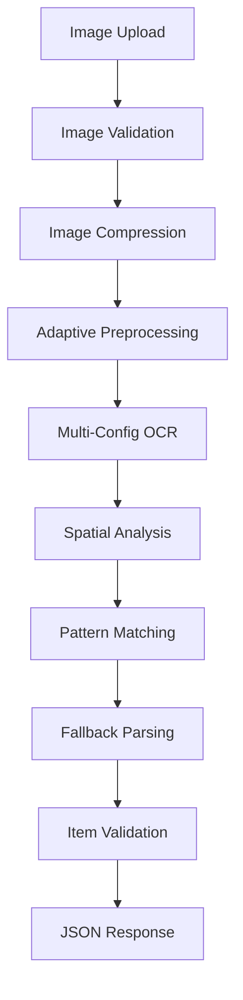

# Split Bill OCR Backend

A robust, serverless Python application that extracts line items from receipt images using advanced OCR techniques and adaptive parsing strategies.

## 🚀 Features

- **Adaptive OCR Processing**: Multiple Tesseract configurations with automatic fallback
- **Dynamic Format Handling**: Supports restaurant, grocery, retail, and generic receipt formats
- **Spatial Analysis**: Uses OCR confidence data and spatial positioning for better accuracy
- **Progressive Parsing**: Multiple parsing strategies with confidence scoring
- **Image Enhancement**: Automatic preprocessing including deskewing, contrast enhancement, and noise reduction
- **FastAPI Backend**: High-performance async API with automatic documentation
- **Docker Ready**: Complete containerization with multi-stage builds
- **Comprehensive Error Handling**: Detailed error messages and logging
- **Input Validation**: File type, size, and format validation

## 🏗️ Architecture

### Core Components

```
split-bill-backend/
├── main.py                 # FastAPI application entry point
├── models.py              # Pydantic data models
├── services/
│   ├── __init__.py
│   ├── exceptions.py      # Custom exception classes
│   ├── ocr_service.py     # Main OCR orchestration
│   ├── image_processor.py # Adaptive image preprocessing
│   └── text_parser.py     # Multi-strategy text parsing
├── requirements.txt       # Python dependencies
├── Dockerfile            # Container configuration
├── test_basic.py         # Basic functionality tests
└── README.md             # This file
```

### Processing Pipeline



## 📋 API Reference

### POST `/api/v1/extract`

Extract line items from a receipt image.

**Request:**

- Method: `POST`
- Content-Type: `multipart/form-data`
- Body: File with key `image`

**Supported Formats:**

- JPEG, JPG, PNG, BMP, TIFF
- Maximum size: 10MB

**Response:**

```json
{
  "items": [
    {
      "description": "Cheeseburger",
      "price": 14.99,
      "quantity": null,
      "confidence": 0.95
    },
    {
      "description": "Fries (x2)",
      "price": 8.5,
      "quantity": 2,
      "confidence": 0.88
    }
  ],
  "metadata": {
    "strategy_used": "spatial_parser",
    "confidence": 0.92,
    "receipt_type": "restaurant",
    "item_count": 2,
    "filename": "receipt.jpg"
  }
}
```

**Error Response:**

```json
{
  "error": "Invalid file type",
  "details": "Supported types: image/jpeg, image/png, image/bmp, image/tiff",
  "error_code": "INVALID_FILE_TYPE"
}
```

### GET `/health`

Health check endpoint.

**Response:**

```json
{
  "status": "healthy",
  "version": "1.0.0",
  "timestamp": "2024-01-15T10:30:00"
}
```

## 🔧 Installation & Setup

### Prerequisites

- Python 3.9+
- Tesseract OCR engine
- OpenCV dependencies

### Local Development

1. **Clone the repository:**

```bash
git clone <repository-url>
cd split-bill-backend
```

2. **Install system dependencies (Ubuntu/Debian):**

```bash
sudo apt-get update
sudo apt-get install tesseract-ocr tesseract-ocr-eng libtesseract-dev
sudo apt-get install libgl1-mesa-glx libglib2.0-0
```

3. **Install Python dependencies:**

```bash
pip install -r requirements.txt
```

4. **Run the application:**

```bash
python main.py
```

The API will be available at `http://localhost:8000`

### Docker Deployment

1. **Build the image:**

```bash
docker build -t split-bill-ocr .
```

2. **Run the container:**

```bash
docker run -p 8000:8000 split-bill-ocr
```

### Cloud Deployment

#### Google Cloud Functions

1. **Install gcloud CLI and authenticate**

2. **Deploy:**

```bash
gcloud functions deploy split-bill-ocr \
  --runtime python311 \
  --trigger-http \
  --allow-unauthenticated \
  --memory 1GB \
  --timeout 60s
```

#### AWS Lambda

Use the `serverless` framework or AWS SAM for deployment. The application is designed to work with serverless architectures.

## 🧠 Advanced Features

### Adaptive Image Processing

The system automatically analyzes image characteristics and applies appropriate preprocessing:

- **Low Contrast Detection**: Applies CLAHE (Contrast Limited Adaptive Histogram Equalization)
- **Skew Detection**: Uses Hough line detection to identify and correct document skew
- **Noise Reduction**: Bilateral filtering for noisy images
- **Adaptive Thresholding**: Multiple thresholding methods with automatic selection

### Multi-Strategy Text Parsing

Three parsing strategies work in sequence:

1. **Spatial Parser**: Uses OCR confidence data and spatial positioning
2. **Pattern Parser**: Regex-based extraction for different receipt types
3. **Fallback Parser**: Simple extraction as last resort

### Receipt Type Classification

Automatic classification into:

- **Restaurant**: Table service, tips, server mentions
- **Grocery**: Quantity patterns, organic items, supermarket keywords
- **Retail**: Store items, sizes, colors, departments
- **Generic**: Fallback for unclassified receipts

## 🧪 Testing

Run the test suite:

```bash
# Install test dependencies
pip install pytest pytest-asyncio httpx

# Run tests
python -m pytest test_basic.py -v

# Run with coverage
pip install pytest-cov
python -m pytest test_basic.py --cov=. --cov-report=html
```

### Manual Testing

```bash
# Test health endpoint
curl http://localhost:8000/health

# Test OCR extraction
curl -X POST \
  -F "image=@test_receipt.jpg" \
  http://localhost:8000/api/v1/extract
```

## 📊 Performance Optimization

### Memory Management

- Automatic image compression for large files
- Streaming processing for memory efficiency
- Cleanup of intermediate processing artifacts

### Speed Optimization

- Early termination when high confidence is achieved
- Cached preprocessing analysis
- Parallel OCR configuration testing

### Resource Limits

- Maximum file size: 10MB
- Maximum image dimensions: 2000x2000 pixels
- Processing timeout: 60 seconds
- Maximum items returned: 50

## 🔍 Troubleshooting

### Common Issues

**"Tesseract not found" error:**

```bash
# Ubuntu/Debian
sudo apt-get install tesseract-ocr

# macOS
brew install tesseract

# Check installation
tesseract --version
```

**Poor OCR accuracy:**

- Ensure images are high contrast
- Avoid blurry or very small text
- Try scanning at higher resolution
- Ensure text is horizontal (not rotated)

**"No items extracted" error:**

- Check if the image contains clear price information
- Verify the receipt format is supported
- Try preprocessing the image manually

### Debug Mode

Enable detailed logging:

```python
import logging
logging.getLogger().setLevel(logging.DEBUG)
```

## 🚀 Deployment Considerations

### Production Settings

1. **Environment Variables:**

```bash
export ENVIRONMENT=production
export LOG_LEVEL=INFO
export MAX_WORKERS=4
```

2. **Security:**

- Implement rate limiting
- Add authentication if needed
- Use HTTPS in production
- Validate file contents beyond MIME type

3. **Monitoring:**

- Health check endpoint for load balancers
- Structured logging for monitoring systems
- Error tracking integration

### Scaling

**Horizontal Scaling:**

- Stateless design allows easy horizontal scaling
- Use load balancers with health checks
- Consider container orchestration (Kubernetes)

**Vertical Scaling:**

- Increase memory for larger images
- More CPU cores for parallel OCR processing
- SSD storage for faster I/O

## 🤝 Contributing

1. Fork the repository
2. Create a feature branch
3. Add tests for new functionality
4. Ensure all tests pass
5. Submit a pull request

### Code Style

Follow PEP 8 and use these tools:

```bash
pip install black flake8 mypy
black .
flake8 .
mypy .
```

## 📝 License

This project is licensed under the MIT License. See LICENSE file for details.

## 🆘 Support

For issues and questions:

1. Check the troubleshooting section
2. Review existing GitHub issues
3. Create a new issue with:
   - Python version
   - OS and version
   - Error messages
   - Sample images (if possible)

## 🔄 Changelog

### v1.0.0

- Initial release
- Adaptive OCR processing
- Multi-strategy parsing
- Docker support
- Comprehensive error handling
- FastAPI implementation

---

**Built with ❤️ for accurate receipt processing**
